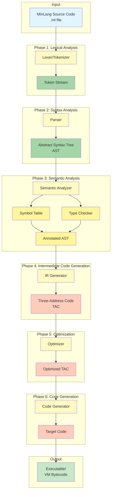
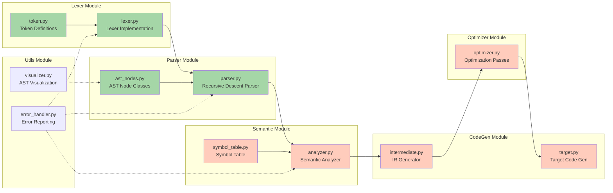
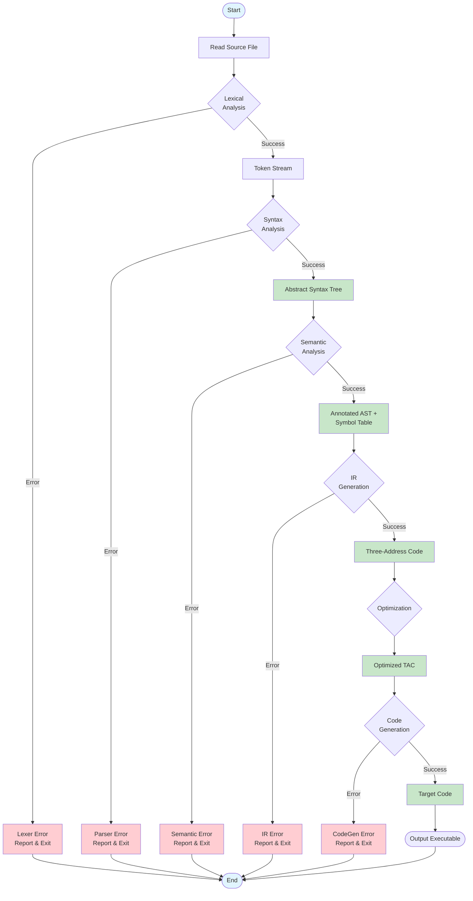
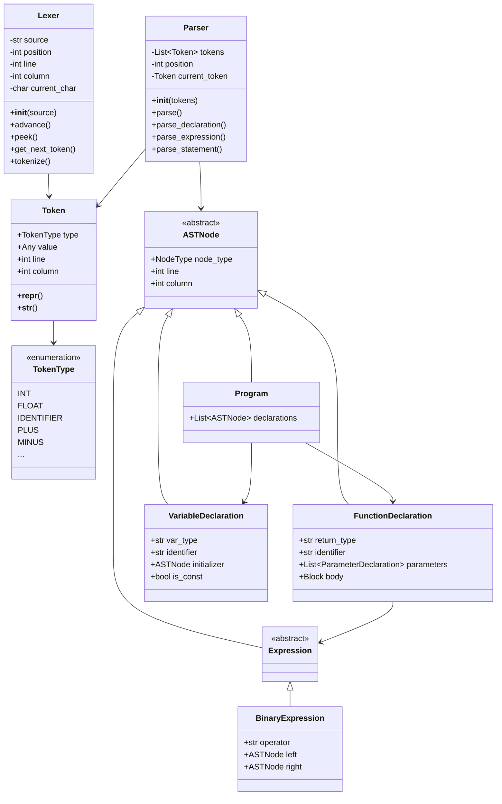
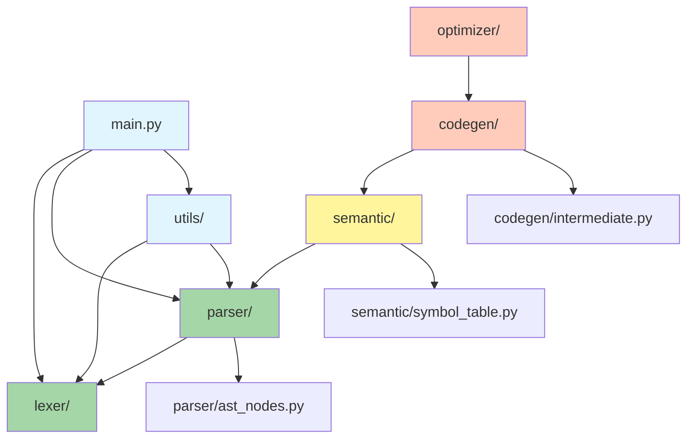

# MinLang Compiler Architecture Diagram

## System Architecture (Mermaid Format)

## Detailed Component Architecture

## Data Flow Diagram

## Class Hierarchy

## Module Dependencies

## Legend

- **Green (Implemented)**: Lexer, Parser, AST Nodes
- **Yellow (Partial)**: Semantic Analysis (planned)
- **Orange (Planned)**: Code Generation, Optimization

## Implementation Status

| Phase | Component | Status | Completion |
|-------|-----------|--------|------------|
| 1 | Lexical Analysis | ✅ Complete | 100% |
| 2 | Syntax Analysis | ✅ Complete | 100% |
| 3 | Semantic Analysis | 📋 Planned | 0% |
| 4 | IR Generation | 📋 Planned | 0% |
| 5 | Optimization | 📋 Planned | 0% |
| 6 | Code Generation | 📋 Planned | 0% |

**Overall Project Completion: 30%**
